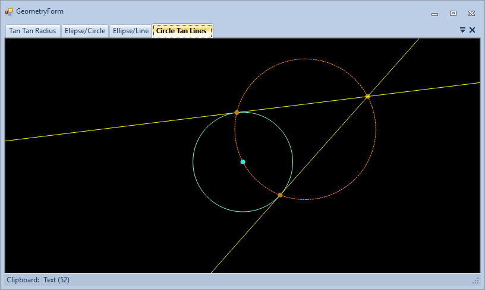

# JA.WinFormTTR

Sample project to demonstrate planar geometry and interactions in Windows Forms.

Sample Screenshot:

This is a Windows Forms application built with .NET Framework 4.8. and Krypton UI toolkit.